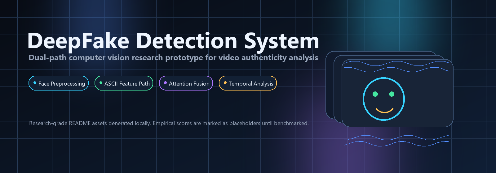
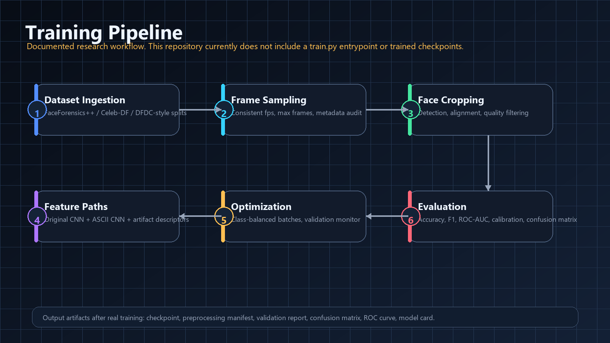
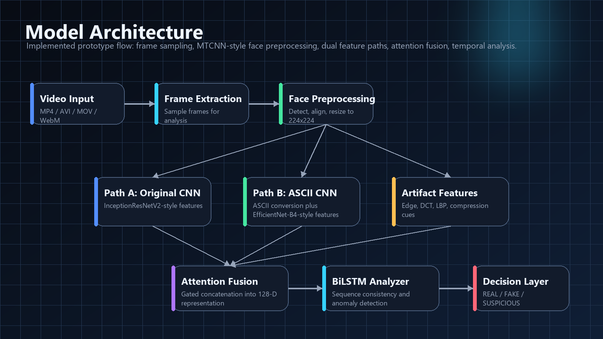
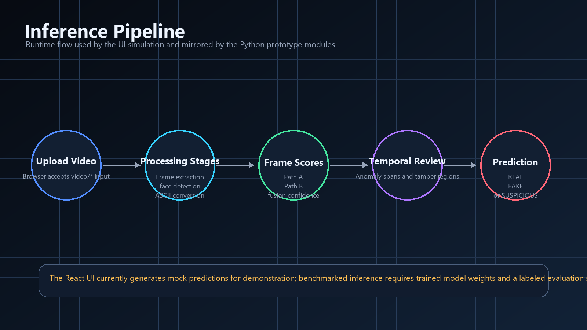
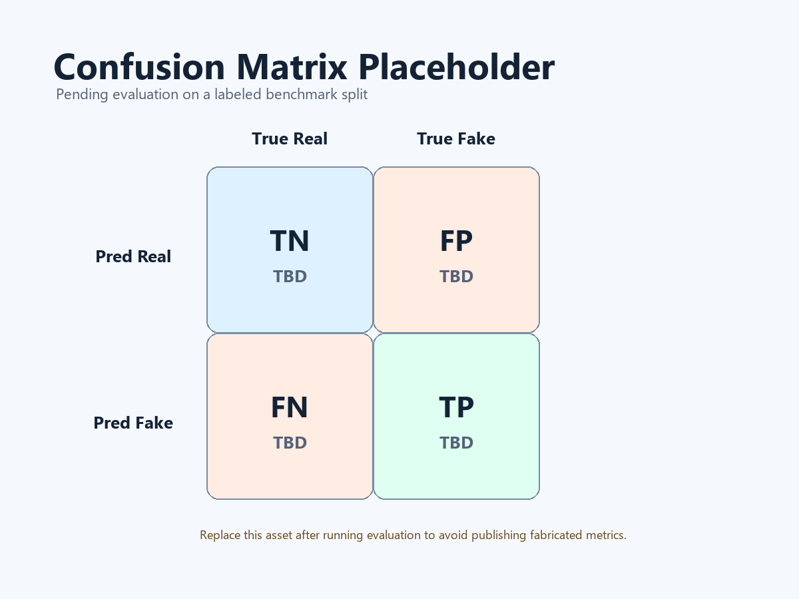
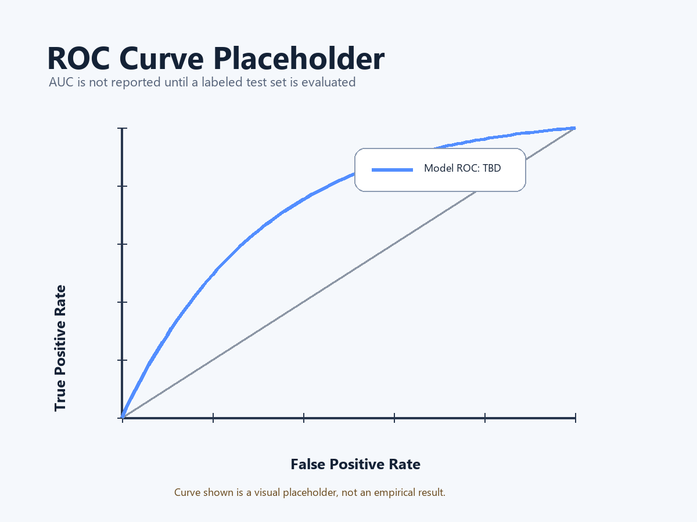
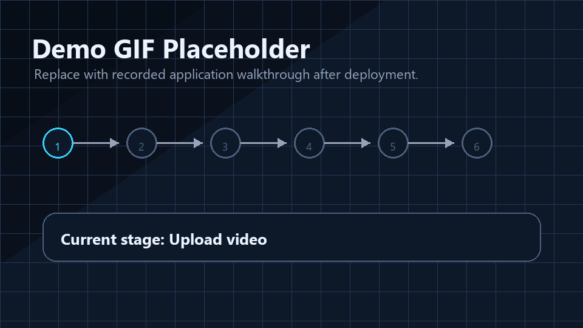
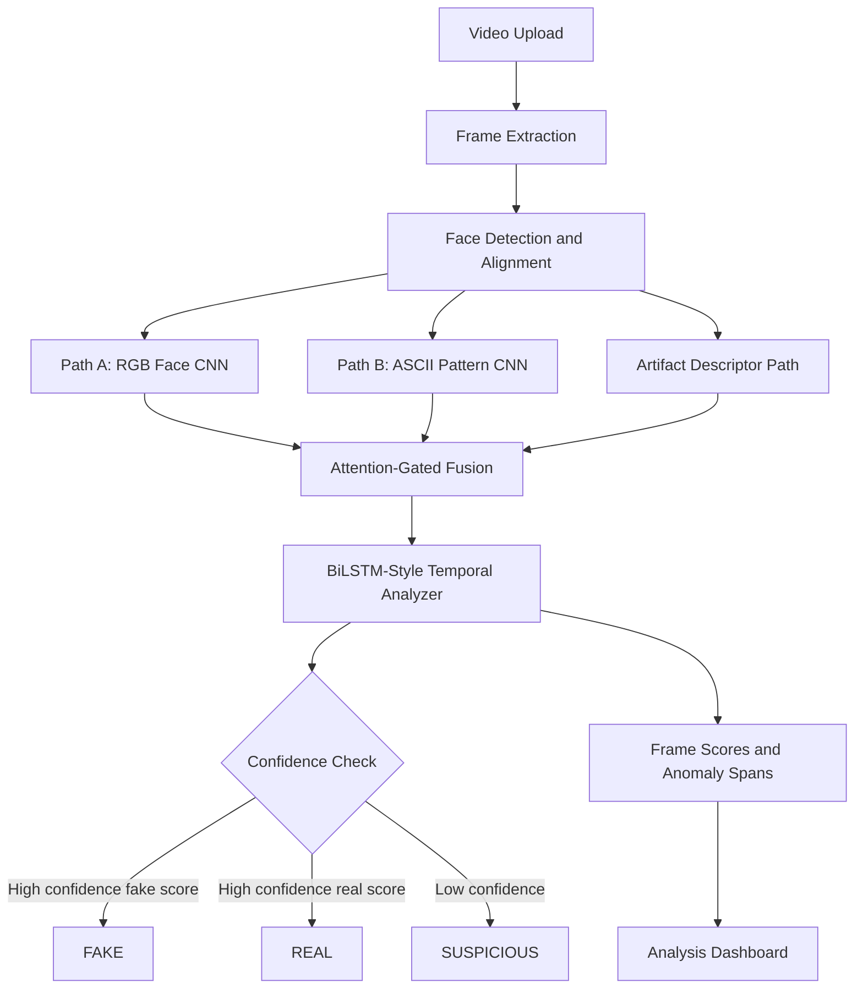

# DeepFake Detection System

<div align="center">
  
  <br />
  <br />
  
  <br />
  <br />

  
  
  
  
  <br />
  <br />

  
  
  
  
  
  
</div>

---

## Abstract

This repository presents a research-oriented prototype for video DeepFake detection. The system is structured around a dual-path computer vision pipeline: one branch analyzes aligned face crops directly, while a second branch converts faces into ASCII-like texture patterns before feature extraction. The prototype then combines spatial CNN-style features, compression-artifact descriptors, and temporal sequence signals to produce a video-level authenticity assessment.

> [!IMPORTANT]
> This repository currently contains a React/Vite demonstration UI and Python prototype modules with simulated model weights and mock predictions. It does not include a released dataset, trained checkpoints, a training script, or empirical benchmark results. All metrics, confusion matrices, ROC curves, and sample predictions in this README are therefore labeled as placeholders until validated on a labeled test set.

## Social Preview

Use the following image as the GitHub repository social preview image.

<p align="center">
  
</p>

## Table of Contents

- [Repository Snapshot](#repository-snapshot)
- [Problem Statement](#problem-statement)
- [Motivation](#motivation)
- [Research and Engineering Signal](#research-and-engineering-signal)
- [DeepFake Detection](#deepfake-detection)
- [Dataset Overview](#dataset-overview)
- [Data Pipeline](#data-pipeline)
- [Model Architecture](#model-architecture)
- [CNN Architecture](#cnn-architecture)
- [Training Pipeline](#training-pipeline)
- [Inference Pipeline](#inference-pipeline)
- [Evaluation Metrics](#evaluation-metrics)
- [Results](#results)
- [Visual Reports](#visual-reports)
- [Mermaid Workflow](#mermaid-workflow)
- [Folder Structure](#folder-structure)
- [Installation](#installation)
- [Training Instructions](#training-instructions)
- [Inference Instructions](#inference-instructions)
- [Sample Predictions](#sample-predictions)
- [Performance Table](#performance-table)
- [Future Improvements](#future-improvements)
- [Challenges](#challenges)
- [Research Learnings](#research-learnings)
- [References](#references)
- [License](#license)
- [Contact](#contact)

## Repository Snapshot

This project is best understood as a polished research prototype and portfolio-grade computer vision scaffold. It demonstrates how a DeepFake detection system can be organized, visualized, and documented, while clearly separating implemented prototype behavior from future benchmark work.

| Area | Implemented in This Repository | Not Implemented Yet |
|---|---|---|
| Frontend | React/Vite upload flow, animated processing stages, analysis dashboard, system monitor UI. | Live backend integration and persisted jobs. |
| Backend | Python prototype modules for video processing, face preprocessing, ASCII conversion, feature fusion, and temporal analysis. | Real video decoding, trained model weights, production inference service. |
| Models | NumPy-based simulated feature extractors and BiLSTM-style sequence logic. | Trainable PyTorch/TensorFlow checkpoints. |
| Evaluation | README placeholders for confusion matrix, ROC curve, and performance tables. | Reproducible benchmark scripts and empirical metrics. |
| Documentation | Research README, diagrams, visual assets, references, setup notes, and limitations. | Model card, dataset card, and formal ethical-use policy. |

## Problem Statement

Modern generative models can synthesize or manipulate facial video with increasingly realistic identity, expression, lip motion, and lighting. A DeepFake detector must distinguish authentic facial video from manipulated content under compression, motion blur, occlusion, lighting changes, and domain shift.

The practical detection challenge is not just binary classification. A useful system should also:

| Requirement | Why It Matters |
|---|---|
| Face-aware preprocessing | Most manipulations occur around the face, jawline, eyes, mouth, and skin texture. |
| Spatial artifact detection | Frame-level CNN features can capture blending, boundary, color, and frequency artifacts. |
| Temporal consistency analysis | Video forensics depends on frame-to-frame stability, not only isolated images. |
| Calibration and confidence | Real-world systems must know when to abstain or flag uncertain content. |
| Transparent evaluation | Accuracy claims are meaningless without dataset, split, threshold, and metric definitions. |

## Motivation

DeepFake detection sits at the intersection of computer vision, media forensics, trust and safety, and responsible AI. A strong detector can help analysts and platforms triage suspicious content, but it must be evaluated honestly because detectors can fail under distribution shift, adversarial compression, unseen generation methods, and demographic imbalance.

This project is motivated by three research questions:

1. Can face-centric preprocessing improve signal quality for manipulated-video detection?
2. Can an alternate ASCII-pattern representation expose texture and compression artifacts that RGB-only models miss?
3. Can temporal fusion reduce false confidence from single-frame artifacts?

## Research and Engineering Signal

For AI Research, Computer Vision, and AI Engineering internship review, this repository is designed to communicate:

| Signal | Evidence in Repository |
|---|---|
| Research taste | Honest benchmark boundaries, dataset discussion, metric discipline, and paper-grounded references. |
| Computer vision understanding | Face alignment, frame sampling, spatial artifacts, frequency cues, and temporal consistency. |
| Systems thinking | Frontend analysis workflow, API-shaped backend prototype, structured result schema, and monitoring view. |
| Documentation maturity | Clear limitations, implementation status, diagrams, reproducible setup steps, and placeholder labeling. |
| Product awareness | Human-readable outputs, confidence reporting, anomaly spans, and real-world application safeguards. |

## DeepFake Detection

DeepFake detection is the task of estimating whether an image or video has been synthetically manipulated. In video, useful forensic cues commonly include:

| Cue Family | Examples |
|---|---|
| Spatial artifacts | Face boundary blending, warped jawline, inconsistent skin texture, eye or teeth artifacts. |
| Frequency artifacts | JPEG blocking, GAN texture patterns, over-smoothed regions, high-frequency inconsistencies. |
| Temporal artifacts | Flicker, unstable landmarks, inconsistent expression dynamics, unnatural motion transitions. |
| Metadata and compression | Codec mismatch, abnormal bitrate patterns, repeated resampling artifacts. |
| Model confidence behavior | Sudden score spikes or disagreement between feature branches. |

> [!NOTE]
> The current implementation simulates many of these signals. It is a strong documentation and interface scaffold, but production detection requires trained models, real video decoding, robust face detection, calibrated thresholds, and benchmark reports.

## Dataset Overview

No dataset is committed to this repository. For research training and evaluation, use public datasets only after reviewing their licenses, consent terms, and access requirements.

| Dataset | Typical Use | Notes |
|---|---|---|
| FaceForensics++ | Controlled facial manipulation benchmark | Includes multiple manipulation methods such as DeepFakes, Face2Face, FaceSwap, and NeuralTextures. |
| Celeb-DF v2 | Higher visual quality celebrity DeepFakes | Useful for testing generalization beyond low-quality artifacts. |
| DFDC | Large-scale challenge-style video benchmark | Useful for more diverse actors, scenes, and generation methods. |
| Custom collected data | Domain-specific validation | Requires consent, privacy review, labeling protocol, and provenance tracking. |

Recommended split strategy:

| Split | Purpose | Leakage Control |
|---|---|---|
| Train | Learn spatial, artifact, and temporal representations | Keep identities and source videos disjoint from validation/test where possible. |
| Validation | Tune threshold, calibration, and model selection | Do not report final metrics from this split. |
| Test | Final benchmark reporting | Freeze threshold before evaluating. |
| External test | Generalization audit | Use unseen generation methods and real-world compression settings. |

## Data Pipeline

The intended data pipeline is face-first and video-aware.

<p align="center">
  
</p>

| Stage | Description | Repository Status |
|---|---|---|
| Video ingestion | Accept video files such as MP4, AVI, MOV, MKV, and WebM. | UI accepts `video/*`; backend lists supported formats. |
| Frame extraction | Sample frames at a controlled frame rate and cap sequence length. | Simulated in `src/backend/utils/video_processor.py`. |
| Face preprocessing | Detect face regions, estimate landmarks, align, crop, resize to `224x224`. | MTCNN-style mock implementation in `src/backend/utils/face_detector.py`. |
| Normalization | Convert RGB values to model-ready tensors using ImageNet-style normalization. | Implemented as prototype preprocessing. |
| Feature extraction | Extract RGB CNN, ASCII CNN, and artifact descriptor features. | Simulated with NumPy feature vectors. |
| Temporal modeling | Analyze frame-level scores across time. | BiLSTM-style implementation in `src/backend/core/temporal_analyzer.py`. |
| Reporting | Produce classification, confidence, frame analysis, anomalies, and tamper regions. | UI renders simulated analysis results. |

### Face Preprocessing

Face preprocessing reduces background noise and concentrates the detector on the manipulated region. The intended steps are:

1. Decode frames from the video.
2. Detect face bounding boxes.
3. Estimate facial landmarks such as eyes, nose, and mouth corners.
4. Align the face using eye geometry.
5. Crop and resize the aligned face to `224x224`.
6. Run quality checks for blur, brightness, contrast, pose, and occlusion.
7. Normalize the tensor before CNN feature extraction.

<details>
<summary>Why face preprocessing matters</summary>

DeepFake artifacts are often local. A full video frame may contain background, clothing, camera motion, subtitles, or compression noise that can drown out subtle face-region signals. Face alignment also makes temporal comparison more stable because the model can compare similar regions across frames.

</details>

## Model Architecture

### Architecture Diagram

<p align="center">
  
</p>

The prototype architecture is organized as a multi-stream detector.

| Component | Role | Current Implementation |
|---|---|---|
| Path A: Original frame path | Extract spatial face features from aligned RGB crops. | InceptionResNetV2-style simulated features. |
| Path B: ASCII path | Convert faces to ASCII-like intensity patterns and analyze texture structure. | ASCII conversion plus EfficientNet-B4-style simulated features. |
| Beadal artifact path | Capture edge, frequency, LBP, and compression-style cues. | Custom NumPy descriptor scaffold. |
| Fusion network | Combine branches with attention-style gates. | Gated feature fusion in `fusion_network.py`. |
| Temporal analyzer | Model sequence-level consistency. | BiLSTM-style NumPy module. |
| Classifier | Convert temporal score and confidence into `REAL`, `FAKE`, or `SUSPICIOUS`. | Threshold-based prototype classifier. |

> [!WARNING]
> Files reference InceptionResNetV2, EfficientNet-B4, MTCNN, and BiLSTM concepts, but the repository does not ship actual pretrained weights or trained PyTorch/TensorFlow models. The current backend uses mock weights and simulated features.

## CNN Architecture

### Path A: Original Face CNN

| Attribute | Value |
|---|---|
| Input | Aligned RGB face crop |
| Input size | `224x224x3` |
| Feature extractor | InceptionResNetV2-style feature vector |
| Feature dimension in prototype | `1536` |
| Intended signal | Spatial consistency, blending, color, edge, and face-region artifacts |

### Path B: ASCII Texture CNN

| Attribute | Value |
|---|---|
| Input | ASCII representation of face intensity patterns |
| Default ASCII width | `40` characters |
| Feature extractor | EfficientNet-B4-style feature vector |
| Feature dimension in prototype | `1792` |
| Intended signal | Texture density, compression signatures, structural discontinuities |

### Artifact Descriptor Path

| Feature Group | Intended Signal |
|---|---|
| Edge features | Boundary artifacts, unnatural contours, edge density shifts. |
| DCT features | Frequency-domain compression and resampling artifacts. |
| LBP features | Local texture irregularities. |
| JPEG artifact estimates | Blocking, ringing, mosquito noise, quality inconsistencies. |

### Fusion Head

| Layer | Description |
|---|---|
| Attention projection | Projects each branch to a shared attention dimension. |
| Attention gate | Learns or simulates branch importance. |
| Concatenation | Combines gated branch embeddings. |
| Fusion layer | Produces a compact fused representation. |
| Temporal input | Supplies frame-level signals to sequence analysis. |

## Training Pipeline

The repository does not currently include a training entrypoint such as `train.py`, a config directory, or saved checkpoints. A complete research training pipeline should add the following:

| Step | Expected Implementation |
|---|---|
| Dataset manifest | CSV/JSONL with video path, label, source dataset, identity, compression level, and split. |
| Preprocessing cache | Stored aligned face crops or frame tensors with reproducible sampling metadata. |
| Augmentation | Compression, blur, color jitter, random crop, frame dropout, and temporal jitter. |
| Model training | Supervised binary classification with class-balanced sampling. |
| Validation | Threshold tuning, calibration, early stopping, and identity-disjoint validation. |
| Testing | Frozen model and frozen threshold evaluated once on a held-out split. |
| Model card | Dataset provenance, intended use, limitations, failure modes, and ethical constraints. |

Suggested future command shape:

```bash
# Not implemented yet. Add this only after training code exists.
python src/backend/train.py --config configs/deepfake_detector.yaml
```

## Inference Pipeline

<p align="center">
  
</p>

Current UI inference is simulated in `src/components/VideoUpload.tsx`. The user selects a video, the UI animates through the pipeline stages, and then it renders a mock `AnalysisResult`.

Intended production inference flow:

1. Upload or stream a video.
2. Validate media type, size, codec, and duration.
3. Extract frames at a controlled sampling rate.
4. Detect and align faces.
5. Run RGB CNN, ASCII CNN, and artifact descriptor paths.
6. Fuse features using attention gates.
7. Analyze temporal consistency across frame sequences.
8. Return classification, confidence, frame-level scores, anomaly spans, and visual evidence.

## Evaluation Metrics

Use multiple metrics because deepfake datasets are often imbalanced and threshold-sensitive.

| Metric | What It Measures | Why It Matters |
|---|---|---|
| Accuracy | Overall correct predictions | Easy to understand, but can hide class imbalance. |
| Precision | Fraction of predicted fakes that are actually fake | Important when false accusations are costly. |
| Recall | Fraction of actual fakes detected | Important when missing manipulated content is costly. |
| F1 Score | Harmonic mean of precision and recall | Useful for imbalanced datasets. |
| ROC-AUC | Ranking quality across thresholds | Useful before selecting an operating threshold. |
| PR-AUC | Precision-recall tradeoff | More informative when fake samples are rare. |
| EER | Equal error rate | Common in biometric and forensic evaluation. |
| Calibration error | Confidence reliability | Critical for human-in-the-loop review. |
| Latency | Time per frame or video | Determines deployment feasibility. |

## Results

No empirical results are available in this repository yet.

| Result Item | Value | Status |
|---|---:|---|
| Accuracy | TBD | Placeholder until benchmark evaluation. |
| Precision | TBD | Placeholder until benchmark evaluation. |
| Recall | TBD | Placeholder until benchmark evaluation. |
| F1 Score | TBD | Placeholder until benchmark evaluation. |
| ROC-AUC | TBD | Placeholder until benchmark evaluation. |
| PR-AUC | TBD | Placeholder until benchmark evaluation. |
| EER | TBD | Placeholder until benchmark evaluation. |
| Inference latency | TBD | Placeholder until measured on target hardware. |
| Model size | TBD | Placeholder until trained checkpoint is exported. |

> [!TIP]
> If you add benchmark results later, include dataset name, split, compression setting, threshold, hardware, code commit, and whether identities are disjoint across splits.

## Visual Reports

### Confusion Matrix Placeholder

<p align="center">
  
</p>

### ROC Curve Placeholder

<p align="center">
  
</p>

### Demo GIF Placeholder

<p align="center">
  
</p>

## Mermaid Workflow



## Folder Structure

```text
.
|-- README.md
|-- package.json
|-- vite.config.ts
|-- tailwind.config.js
|-- public/
|   `-- readme/
|       |-- architecture.png
|       |-- training-pipeline.png
|       |-- prediction-flow.png
|       |-- confusion-matrix.png
|       |-- roc-curve.png
|       |-- social-preview.png
|       |-- hero-banner.png
|       |-- typing-banner.gif
|       `-- demo.gif
`-- src/
    |-- App.tsx
    |-- main.tsx
    |-- index.css
    |-- types/
    |   `-- index.ts
    |-- components/
    |   |-- Header.tsx
    |   |-- VideoUpload.tsx
    |   |-- AnalysisDashboard.tsx
    |   `-- SystemMonitor.tsx
    `-- backend/
        |-- main.py
        |-- core/
        |   |-- ascii_converter.py
        |   |-- feature_extractor.py
        |   |-- fusion_network.py
        |   `-- temporal_analyzer.py
        `-- utils/
            |-- face_detector.py
            `-- video_processor.py
```

## Installation

### Prerequisites

| Tool | Version | Required For |
|---|---:|---|
| Node.js | `18+` | React/Vite frontend |
| npm | Bundled with Node.js | Dependency installation |
| Python | `3.9+` | Optional backend prototype |
| Modern browser | Current stable release | Running the UI |

### Frontend Setup

```bash
git clone <repository-url>
cd DEEPFAKE-DETECTOR-main
npm install
npm run dev
```

Open the local Vite URL printed in your terminal, usually:

```text
http://localhost:5173
```

### Optional Backend Prototype Setup

This repository does not include a `requirements.txt`, so install the minimal prototype dependencies manually:

```bash
python -m venv .venv
.\.venv\Scripts\activate
python -m pip install --upgrade pip
python -m pip install numpy fastapi uvicorn python-multipart
python src/backend/main.py
```

If your shell supports `python3`, the package script can also be used:

```bash
npm run server
```

## Training Instructions

Training is not currently implemented in this repository.

Before training can be run, add:

| Missing Piece | Purpose |
|---|---|
| `requirements.txt` or `pyproject.toml` | Reproducible Python environment. |
| Dataset manifest builder | Repeatable train/validation/test splits. |
| `Dataset` and `DataLoader` code | Efficient video/frame loading. |
| Model implementation | Real CNN and temporal modules with trainable parameters. |
| Training loop | Loss, optimizer, scheduler, checkpointing, logging. |
| Evaluation script | Frozen benchmark reports and plots. |

Recommended training protocol:

1. Build identity-disjoint dataset splits.
2. Cache aligned face crops with preprocessing metadata.
3. Train the spatial branches with class-balanced sampling.
4. Add temporal sequence training after frame-level features stabilize.
5. Tune threshold on validation only.
6. Evaluate once on the held-out test set.
7. Export checkpoint, confusion matrix, ROC curve, and model card.

## Inference Instructions

### UI Demonstration

```bash
npm install
npm run dev
```

Then:

1. Open the Vite development URL.
2. Upload a video file.
3. Click `Start Analysis`.
4. Review the simulated dashboard with frame scores, ASCII preview, temporal anomalies, and model path summaries.

### Backend Prototype

```bash
python src/backend/main.py
```

When FastAPI dependencies are installed, the prototype exposes:

| Endpoint | Purpose |
|---|---|
| `POST /api/detect` | Submit a video for background processing. |
| `GET /api/status/{video_id}` | Check processing status. |
| `GET /api/results/{video_id}` | Retrieve detection results. |
| `GET /api/health` | Return system health payload. |
| `GET /api/metrics` | Return simulated system metrics. |

> [!CAUTION]
> The backend currently simulates frame extraction and model scoring. Do not use its output as forensic evidence.

## Sample Predictions

The current UI generates random demonstration results. The table below documents the intended output schema, not measured model behavior.

| Field | Type | Meaning |
|---|---|---|
| `videoId` | string | Unique identifier for the submitted video. |
| `classification` | `REAL` / `FAKE` / `SUSPICIOUS` | Final authenticity label. |
| `overallScore` | number | Video-level score after temporal analysis. |
| `confidence` | number | Model confidence estimate. |
| `frameAnalysis` | array | Per-frame branch scores and detected artifacts. |
| `temporalAnomalies` | array | Suspicious frame ranges and anomaly descriptions. |
| `asciiPreview` | array | ASCII pattern previews for early frames. |
| `tamperLocalization` | array | Prototype bounding boxes for suspicious regions. |

Example response shape:

```json
{
  "videoId": "vid_<timestamp>",
  "filename": "sample.mp4",
  "classification": "SUSPICIOUS",
  "overallScore": "<computed_after_real_inference>",
  "confidence": "<computed_after_real_inference>",
  "frameAnalysis": [],
  "temporalAnomalies": [],
  "asciiPreview": [],
  "tamperLocalization": []
}
```

## Performance Table

| Capability | Current Repository | Benchmark-Ready Requirement |
|---|---|---|
| Frontend upload flow | Implemented | Add real API integration and error states. |
| Analysis dashboard | Implemented with simulated data | Connect to real inference output. |
| Frame extraction | Simulated | Use OpenCV, PyAV, Decord, or similar video decoding. |
| Face detection | MTCNN-style mock | Replace with robust detector and actual landmark model. |
| CNN features | Simulated NumPy vectors | Replace with trained CNN checkpoints. |
| Temporal model | BiLSTM-style NumPy scaffold | Train/evaluate real sequence model. |
| Confusion matrix | Placeholder asset | Generate from labeled test predictions. |
| ROC curve | Placeholder asset | Generate from labeled test scores. |
| Published metrics | Not available | Report only after reproducible evaluation. |

## Real-World Applications

| Application | How Detection Helps | Required Safeguards |
|---|---|---|
| Newsroom verification | Prioritize suspicious videos for expert review. | Human-in-the-loop review and source verification. |
| Trust and safety | Triage manipulated media at platform scale. | Appeals, uncertainty thresholds, fairness audits. |
| Enterprise security | Detect impersonation attempts in sensitive workflows. | Multi-factor verification and privacy controls. |
| Digital forensics | Assist analysts during media authenticity investigations. | Chain-of-custody and explainable evidence reports. |
| Education and media literacy | Demonstrate how manipulation artifacts appear. | Clear warnings that demos are not definitive proof. |

## Future Improvements

| Area | Improvement |
|---|---|
| Real model training | Add PyTorch or TensorFlow implementation with real checkpoints. |
| Video decoding | Replace synthetic frames with OpenCV/PyAV extraction. |
| Face detection | Integrate a production face detector and landmark alignment model. |
| Evaluation | Add reproducible scripts for metrics, confusion matrix, ROC, PR curves, and calibration. |
| Explainability | Add Grad-CAM, frame attribution, and branch-disagreement visualization. |
| Robustness | Test compression, resizing, blur, screen recording, and adversarial perturbations. |
| Deployment | Add Dockerfile, API auth, async job queue, and object storage integration. |
| Documentation | Add model card, dataset card, and ethical use policy. |

## Challenges

DeepFake detection remains difficult because:

- Generators improve rapidly, often erasing obvious artifacts.
- Compression can remove forensic signals or create false artifacts.
- Detectors overfit to dataset-specific generation methods.
- Identity leakage can inflate metrics when the same person appears across splits.
- Single-frame detectors can miss temporal anomalies.
- Real-world deployment requires calibrated uncertainty and review workflows.
- False positives can harm people, so results must be interpreted carefully.

## Research Learnings

Key lessons reflected by this project design:

| Learning | Practical Implication |
|---|---|
| Preprocessing is part of the model | Poor face crops can dominate downstream errors. |
| Multi-stream features can improve coverage | RGB, texture, frequency, and temporal signals catch different failure modes. |
| Metrics need provenance | A number without dataset, split, threshold, and hardware context is not meaningful. |
| Video models need temporal tests | Frame accuracy does not guarantee sequence-level robustness. |
| Explainability is operationally important | Analysts need evidence, not only a label. |
| Ethical use matters | Detection should support review, not become an unquestioned authority. |

## References

The citations below were verified against their arXiv titles and identifiers.

| Topic | Reference |
|---|---|
| Facial manipulation benchmark | [FaceForensics++: Learning to Detect Manipulated Facial Images](https://arxiv.org/abs/1901.08971) |
| High-quality DeepFake benchmark | [Celeb-DF: A Large-scale Challenging Dataset for DeepFake Forensics](https://arxiv.org/abs/1909.12962) |
| Large-scale challenge dataset | [The DeepFake Detection Challenge Dataset](https://arxiv.org/abs/2006.07397) |
| Face detection and alignment | [Joint Face Detection and Alignment using Multi-task Cascaded Convolutional Networks](https://arxiv.org/abs/1604.02878) |
| Inception-ResNet architecture | [Inception-v4, Inception-ResNet and the Impact of Residual Connections on Learning](https://arxiv.org/abs/1602.07261) |
| Efficient CNN scaling | [EfficientNet: Rethinking Model Scaling for Convolutional Neural Networks](https://arxiv.org/abs/1905.11946) |

## License

No standalone `LICENSE` file is currently present in this repository. Add a license file before distributing, reusing, or publishing the project as open source.

Suggested next step:

```text
Add LICENSE with the intended license, for example MIT, Apache-2.0, or another license approved by the project owner.
```

## Contact

Maintainer: **Gagandeep Singh**

For collaboration, issues, or research discussion, add a GitHub profile, email address, or LinkedIn link here.

---

<div align="center">
  <strong>Built as a research-quality DeepFake detection prototype scaffold.</strong>
  <br />
  Real benchmark numbers should be added only after reproducible evaluation.
</div>
